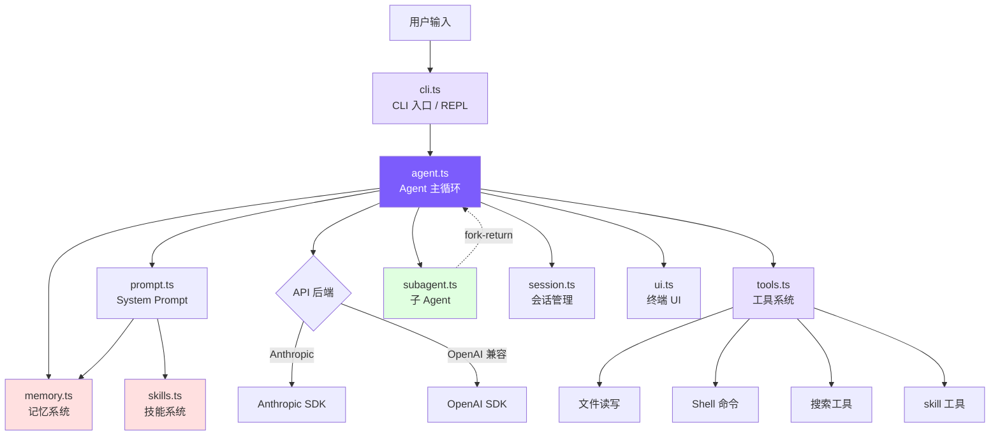

# 引言：为什么从零造一个 Claude Code？

## 本章目标

理解项目定位、技术栈选择和整体架构，5 分钟内跑起来你自己的 coding agent。

## 项目定位

这不是一个 Claude Code 的克隆品——它是一个**教学工具**。

Claude Code 的开源快照有 50 万行 TypeScript，包含 66+ 工具、React/Ink TUI、MCP 协议、OAuth 认证、多代理系统等复杂功能。直接阅读源码，很难理清核心脉络。

我们的做法是：**只保留造一个可用 coding agent 的最小必要组件**，用 ~3000 行代码复现核心能力及进阶特性（记忆、技能、多 Agent、权限规则、分级压缩、预算控制）。每一步都对照 Claude Code 真实源码讲解"它怎么做的 → 我们怎么简化的"。

读完这个教程，你会理解：

- 一个 coding agent 的核心是什么（提示：不是 UI，是 Agent Loop）
- Claude Code 的关键设计决策背后的原因
- 如何用最少的代码构建一个真正能写代码的 AI 助手

## 架构全景



**11 个文件，各司其职：**

| 文件 | 行数 | 职责 |
|------|------|------|
| `agent.ts` | ~1064 | Agent 主循环：消息构造、API 调用、工具编排、子 Agent、4 层上下文压缩、预算控制 |
| `tools.ts` | ~667 | 工具定义 + 执行：8 个工具 + 5 种权限模式 + 引号容错 + diff 输出 |
| `cli.ts` | ~336 | CLI 入口、参数解析、REPL 交互、技能/记忆命令、预算 flags |
| `memory.ts` | ~205 | 记忆系统：4 类型 + 文件存储 + 关键词召回 |
| `ui.ts` | ~187 | 终端输出：颜色、格式化、子 Agent 显示 |
| `skills.ts` | ~175 | 技能系统：目录发现 + frontmatter 解析 + inline/fork 双模式 |
| `subagent.ts` | ~172 | 子 Agent 类型配置（3 内置 + 自定义 Agent 发现） |
| `prompt.ts` | ~76 | System Prompt 构造：模板 + 变量替换 + 记忆/技能/Agent 注入 |
| `session.ts` | ~63 | 会话持久化：JSON 文件存储 |
| `frontmatter.ts` | ~41 | 共享 YAML frontmatter 解析器 |

## 技术栈

```
TypeScript           — 类型安全，与 Claude Code 同语言
@anthropic-ai/sdk    — Anthropic 官方 SDK
openai               — OpenAI 兼容后端支持
chalk                — 终端颜色输出
glob                 — 文件模式匹配
```

没有框架、没有 React、没有构建工具链——只有最基础的依赖。

## 快速开始

```bash
# 克隆项目
git clone https://github.com/Windy3f3f3f3f/claude-code-from-scratch.git
cd claude-code-from-scratch

# 安装依赖
npm install

# 设置 API Key
export ANTHROPIC_API_KEY=sk-ant-xxx

# 开发模式运行
npm run dev

# 或者编译后运行
npm run build
npm start
```

运行后你会看到：

```
  Mini Claude Code — A minimal coding agent

  Type your request, or 'exit' to quit.
  Commands: /clear /cost /compact /memory /skills /plan

>
```

试试输入 `read src/agent.ts and explain the main loop`，你的 mini coding agent 就会开始工作了。

### 使用 OpenAI 兼容后端

```bash
OPENAI_API_KEY=sk-xxx mini-claude --api-base https://api.openai.com/v1 --model gpt-4o "hello"
```

### 其他选项

```bash
mini-claude --yolo "run all tests"          # 跳过所有确认（bypassPermissions）
mini-claude --plan "analyze this codebase"  # 只分析不修改（plan 模式）
mini-claude --accept-edits "refactor"       # 自动批准文件编辑
mini-claude --dont-ask "check style"        # CI 模式：需确认的操作自动拒绝
mini-claude --thinking "analyze this bug"   # 启用 Extended Thinking
mini-claude --resume                        # 恢复上次会话
mini-claude --max-cost 0.50 --max-turns 20  # 预算控制
```

## 各章概览

| 章节 | mini-claude 文件 | Claude Code 对应源码 |
|------|-----------------|---------------------|
| [1. Agent Loop](docs/01-agent-loop.md) | `agent.ts` 的 `chatAnthropic()` | `src/query.ts` 的 `queryLoop` |
| [2. 工具系统](docs/02-tools.md) | `tools.ts` | `src/Tool.ts` + `src/tools/` (66+ 工具) |
| [3. System Prompt](docs/03-system-prompt.md) | `prompt.ts` + `system-prompt.md` | `src/constants/prompts.ts` |
| [4. 流式输出](docs/04-streaming.md) | `agent.ts` 的两套 stream 方法 | `src/services/api/claude.ts` |
| [5. 权限与安全](docs/05-safety.md) | `tools.ts` 的 `needsConfirmation()` | `src/utils/permissions/` (52KB) |
| [6. 上下文管理](docs/06-context.md) | `agent.ts` 的 `checkAndCompact()` | `src/services/compact/` |
| [7. CLI 与会话](docs/07-cli-session.md) | `cli.ts` + `session.ts` | `src/entrypoints/cli.tsx` |
| [8. 记忆与技能](docs/08-memory-skills.md) | `memory.ts` + `skills.ts` | 记忆系统 + 技能系统 |
| [9. 多 Agent](docs/09-multi-agent.md) | `subagent.ts` + `agent.ts` | `src/tools/AgentTool/` |
| [10. 权限规则](docs/10-permission-rules.md) | `tools.ts` 权限规则 | `src/utils/permissions/` |
| [11. 架构对比](docs/11-whats-next.md) | 全局对比 | 全局对比 |

---

> **下一章**：我们从最核心的部分开始——Agent Loop，这是整个 coding agent 的心脏。
