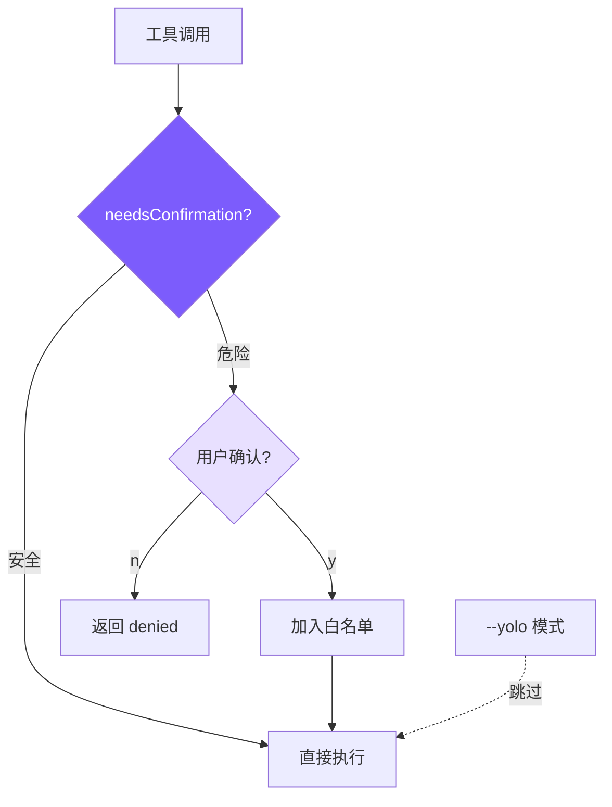

# 5. 权限与安全

## 本章目标

实现一个轻量但有效的安全机制：识别危险操作 → 向用户确认 → 记住已授权的操作。



## Claude Code 怎么做的

Claude Code 有一套 **7 层防御体系**（5 外部 + 2 内部），这里只列核心的 5 层：

### 1. System Prompt 层
在 prompt 中明确禁止特定行为（"NEVER run git push --force to main"）。

### 2. 权限模式
三种模式：`default`（正常确认）、`auto`（自动允许已配置的）、`bypass`（全跳过）。

### 3. BashTool AST 分析 — `src/tools/BashTool/`
对 shell 命令进行 AST 解析（不是正则），精确判断命令是否安全：

```typescript
// Claude Code 的 BashTool 安全检查（简化）
function analyzeCommand(cmd: string): SecurityAssessment {
  const ast = parseShellAST(cmd);  // 解析成 AST
  for (const node of ast.commands) {
    if (isDangerousCommand(node)) {
      return { level: "dangerous", reason: "..." };
    }
  }
  return { level: "safe" };
}
```

### 4. 危险模式库 — `src/utils/permissions/dangerousPatterns.ts`
维护一个详细的危险模式列表，每个模式有分类和说明。

### 5. 权限配置文件
持久化的权限配置，让用户可以预先授权某些操作。

完整的权限系统在 `src/utils/permissions/permissions.ts` 中，**52KB 一个文件**。

## 我们的实现

我们把 5 层简化为 **3 个组件**：

### 1. 危险命令检测：16 个正则（含 6 个 Windows 专用）

```typescript
// tools.ts — 危险命令模式

const DANGEROUS_PATTERNS = [
  // Unix/通用
  /\brm\s/,                              // rm 删除
  /\bgit\s+(push|reset|clean|checkout\s+\.)/, // git 破坏性操作
  /\bsudo\b/,                             // 提权
  /\bmkfs\b/,                             // 格式化
  /\bdd\s/,                               // 磁盘操作
  />\s*\/dev\//,                           // 写设备文件
  /\bkill\b/,                             // 杀进程
  /\bpkill\b/,                            // 批量杀进程
  /\breboot\b/,                           // 重启
  /\bshutdown\b/,                         // 关机
  // Windows 专用
  /\bdel\s/i,                             // Windows 删除文件
  /\brmdir\s/i,                           // Windows 删除目录
  /\bformat\s/i,                          // Windows 格式化磁盘
  /\btaskkill\s/i,                        // Windows 杀进程
  /\bRemove-Item\s/i,                     // PowerShell 删除
  /\bStop-Process\s/i,                    // PowerShell 杀进程
];

export function isDangerous(command: string): boolean {
  return DANGEROUS_PATTERNS.some((p) => p.test(command));
}
```

### 2. 统一权限检查：needsConfirmation

```typescript
// tools.ts — needsConfirmation

export function needsConfirmation(
  toolName: string,
  input: Record<string, any>
): string | null {
  // Shell 命令：检查危险模式
  if (toolName === "run_shell" && isDangerous(input.command)) {
    return input.command;  // 返回命令内容作为确认信息
  }
  // 写新文件需要确认
  if (toolName === "write_file" && !existsSync(input.file_path)) {
    return `write new file: ${input.file_path}`;
  }
  // 编辑不存在的文件
  if (toolName === "edit_file" && !existsSync(input.file_path)) {
    return `edit non-existent file: ${input.file_path}`;
  }
  return null;  // 安全，不需要确认
}
```

设计决策：

- **`run_shell` + 危险模式** → 需要确认
- **`write_file` + 新文件** → 需要确认（防止创建意外文件）
- **`edit_file` + 不存在** → 需要确认（会失败，但给用户提示）
- **`read_file`、`list_files`、`grep_search`** → 永远安全，无需确认

### 3. 会话级白名单：confirmedPaths

在 Agent Loop 中，权限检查和白名单结合使用：

```typescript
// agent.ts — chatAnthropic 中的权限检查

// Agent 类成员
private confirmedPaths: Set<string> = new Set();

// 在工具执行前检查（5 种权限模式：default/plan/acceptEdits/bypassPermissions/dontAsk）
const confirmMsg = needsConfirmation(toolUse.name, input, this.permissionMode);
if (confirmMsg && !this.confirmedPaths.has(confirmMsg)) {
  // 弹出确认提示
  const confirmed = await this.confirmDangerous(confirmMsg);
  if (!confirmed) {
    toolResults.push({
      type: "tool_result",
      tool_use_id: toolUse.id,
      content: "User denied this action.",
    });
    continue;  // 跳过这个工具，但不中断整个循环
  }
  // 记住用户的授权
  this.confirmedPaths.add(confirmMsg);
}
```

关键设计：

- **`confirmedPaths` 是 Set**：同一个操作只确认一次
- **"User denied" 作为工具结果**：而不是抛错或中断循环。LLM 看到 denied 后会调整策略
- **`--yolo` 跳过所有检查**：`permissionMode === "bypassPermissions"` 时 `needsConfirmation` 直接返回 null

### 确认对话框的实现

```typescript
// agent.ts — confirmDangerous

private async confirmDangerous(command: string): Promise<boolean> {
  printConfirmation(command);  // "⚠ Dangerous command: rm -rf ..."
  const rl = readline.createInterface({
    input: process.stdin,
    output: process.stdout,
  });
  return new Promise((resolve) => {
    rl.question("  Allow? (y/n): ", (answer) => {
      rl.close();
      resolve(answer.toLowerCase().startsWith("y"));
    });
  });
}
```

用临时的 readline 接口实现，避免与 REPL 的 readline 冲突。

### 5 种权限模式

Claude Code 有 5 种权限模式，我们全部实现了：

```typescript
// tools.ts
export type PermissionMode = "default" | "plan" | "acceptEdits" | "bypassPermissions" | "dontAsk";
```

| 模式 | 读工具 | 编辑工具 | Shell（安全） | Shell（危险） | 适用场景 |
|------|--------|----------|-------------|-------------|---------|
| `default` | ✅ allow | ⚠️ confirm(新文件) | ✅ allow | ⚠️ confirm | 日常使用 |
| `plan` | ✅ allow | ❌ **deny** | ✅ allow | ⚠️ confirm | 只规划不执行 |
| `acceptEdits` | ✅ allow | ✅ **allow** | ✅ allow | ⚠️ confirm | 信任编辑 |
| `bypassPermissions` | ✅ allow | ✅ allow | ✅ allow | ✅ allow | 全信任（--yolo） |
| `dontAsk` | ✅ allow | ❌ **deny** | ✅ allow | ❌ **deny** | CI/非交互 |

```typescript
// tools.ts — checkPermission 中的模式处理

export function checkPermission(
  toolName: string,
  input: Record<string, any>,
  mode: PermissionMode = "default"
): { action: "allow" | "deny" | "confirm"; message?: string } {
  // bypassPermissions: allow everything
  if (mode === "bypassPermissions") return { action: "allow" };

  // 读工具在所有模式下都安全
  if (READ_TOOLS.has(toolName)) return { action: "allow" };

  // plan 模式: 阻止所有编辑工具（plan 文件除外）+ shell 命令
  if (mode === "plan") {
    if (EDIT_TOOLS.has(toolName)) {
      const filePath = input.file_path || input.path;
      if (planFilePath && filePath === planFilePath) {
        return { action: "allow" }; // plan 文件是唯一可写的
      }
      return { action: "deny", message: `Blocked in plan mode: ${toolName}` };
    }
    if (toolName === "run_shell") {
      return { action: "deny", message: "Shell commands blocked in plan mode" };
    }
  }

  // acceptEdits: 文件编辑自动放行
  if (mode === "acceptEdits" && EDIT_TOOLS.has(toolName)) {
    return { action: "allow" };
  }

  // ... 内置危险检查 ...

  // dontAsk: 需确认的直接拒绝（适用于 CI 环境）
  if (needsConfirm && mode === "dontAsk") {
    return { action: "deny", message: `Auto-denied (dontAsk mode): ${confirmMessage}` };
  }
}
```

CLI 对应的 flags：

```bash
mini-claude --yolo "..."           # bypassPermissions
mini-claude --plan "..."           # plan mode: 只分析不修改
mini-claude --accept-edits "..."   # acceptEdits: 自动批准编辑
mini-claude --dont-ask "..."       # dontAsk: CI 模式
```

**`plan` 模式的动态切换**：除了 `--plan` CLI flag，模型还可以在对话中通过 `enter_plan_mode` / `exit_plan_mode` 工具动态切换。进入 plan mode 时，系统会生成一个 plan 文件路径（`~/.claude/plans/plan-<sessionId>.md`），这是 plan mode 中唯一可写的文件。退出时恢复之前的权限模式。系统提示中会注入结构化的工作流指引（Explore → Design → Write Plan → Exit），与 Claude Code 官方实现对齐。

**`dontAsk` 的设计意义**：在 CI/CD 管道中运行时，没有用户来回答确认问题。`dontAsk` 让任何需要确认的操作直接失败，agent 看到 denied 后会调整策略（比如用更安全的方式完成任务）。

### 权限规则：.claude/settings.json

除了内置模式，还支持配置化的 allow/deny 规则（详见第 10 章）：

```json
{
  "permissions": {
    "allow": ["read_file", "run_shell(npm test*)"],
    "deny": ["run_shell(rm -rf*)"]
  }
}
```

**优先级**：deny 规则 > allow 规则 > 模式逻辑 > 内置危险检测。

## 安全模型的局限性

我们的安全机制相比 Claude Code 仍有简化：

1. **正则匹配 vs AST 分析**：`rm -rf /` 能捕获，但 `find / -delete` 捕获不了
2. **没有沙箱**：命令在当前用户权限下执行
3. **没有 bypass-immune**：Claude Code 中某些危险路径（.git/、.ssh/）即使在 bypass 模式也需要确认

但核心架构已对齐——5 种权限模式 + 配置化规则 + 内置检测，层次清晰。

## 简化对比

| 维度 | Claude Code | mini-claude |
|------|------------|-------------|
| **防御层次** | 7 层 | 4 层（模式 + 规则 + 检测 + 确认） |
| **命令分析** | AST 解析（23 项检查） | 正则匹配（10 模式） |
| **权限模式** | 5 种 + 2 内部 | 5 种（default/plan/acceptEdits/bypass/dontAsk） |
| **权限规则** | 8 源优先级 + 3 种匹配 | 2 源（用户 + 项目）+ 前缀匹配 |
| **白名单** | 持久化 + 会话级 | 会话级 Set |
| **沙箱** | macOS Seatbelt / Linux namespace | 无 |
| **代码量** | ~52KB（permissions.ts 一个文件） | ~120 行 |

---

> **下一章**：安全机制保护了系统边界，但还有一个内部边界需要管理——LLM 的上下文窗口。当对话太长时怎么办？
