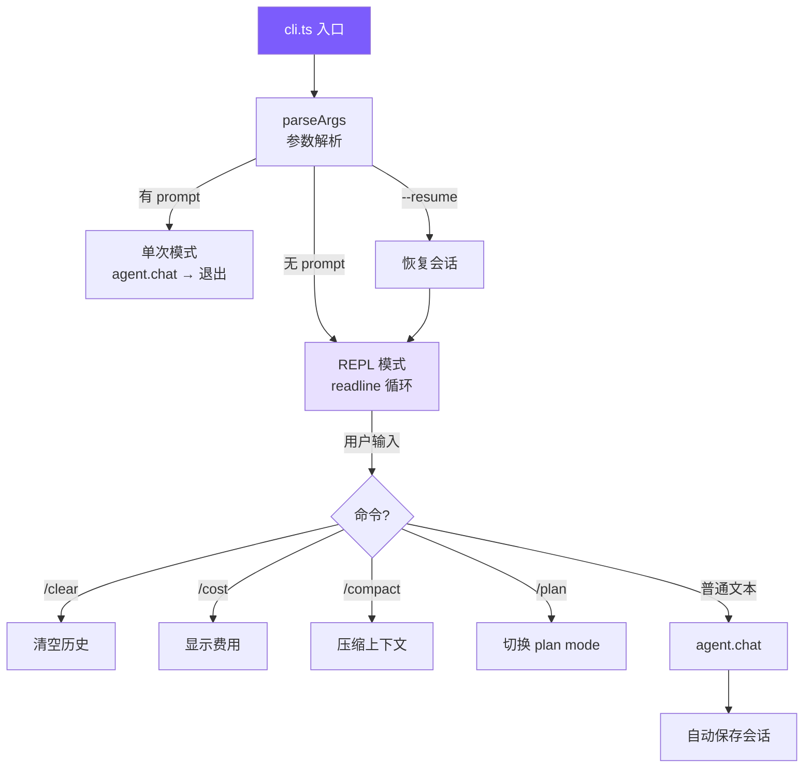

# 7. CLI、REPL 与会话

## 本章目标

构建用户接口层：命令行参数解析、交互式 REPL、Ctrl+C 中断处理、会话持久化和恢复。



## Claude Code 怎么做的

Claude Code 的入口是 `src/entrypoints/cli.tsx`——一个 **React/Ink TUI 应用**：

- 使用 `commander.js` 解析参数
- 使用 React 组件渲染终端 UI（Ink 框架）
- 会话管理在 `src/utils/sessionStorage.ts`，用 JSONL 格式存储
- 复杂的历史管理在 `src/history.ts`
- 支持 Vim mode、多 Tab、IDE 集成等

## 我们的实现

### 参数解析：手写，不用框架

```typescript
// cli.ts — parseArgs

interface ParsedArgs {
  permissionMode: PermissionMode;  // 5 种权限模式
  model: string;
  apiBase?: string;
  prompt?: string;
  resume?: boolean;
  thinking?: boolean;
  maxCost?: number;
  maxTurns?: number;
}

function parseArgs(): ParsedArgs {
  const args = process.argv.slice(2);
  let permissionMode: PermissionMode = "default";
  let thinking = false;
  let model = process.env.MINI_CLAUDE_MODEL || "claude-opus-4-6";
  let apiBase: string | undefined;
  let resume = false;
  let maxCost: number | undefined;
  let maxTurns: number | undefined;
  const positional: string[] = [];

  for (let i = 0; i < args.length; i++) {
    if (args[i] === "--yolo" || args[i] === "-y") {
      permissionMode = "bypassPermissions";
    } else if (args[i] === "--plan") {
      permissionMode = "plan";
    } else if (args[i] === "--accept-edits") {
      permissionMode = "acceptEdits";
    } else if (args[i] === "--dont-ask") {
      permissionMode = "dontAsk";
    } else if (args[i] === "--thinking") {
      thinking = true;
    } else if (args[i] === "--model" || args[i] === "-m") {
      model = args[++i] || model;
    } else if (args[i] === "--api-base") {
      apiBase = args[++i];
    } else if (args[i] === "--resume") {
      resume = true;
    } else if (args[i] === "--max-cost") {
      const v = parseFloat(args[++i]);
      if (!isNaN(v)) maxCost = v;
    } else if (args[i] === "--max-turns") {
      const v = parseInt(args[++i], 10);
      if (!isNaN(v)) maxTurns = v;
    } else if (args[i] === "--help" || args[i] === "-h") {
      console.log(`Usage: mini-claude [options] [prompt] ...`);
      process.exit(0);
    } else {
      positional.push(args[i]);
    }
  }

  return {
    permissionMode, model, apiBase, resume, thinking, maxCost, maxTurns,
    prompt: positional.length > 0 ? positional.join(" ") : undefined,
  };
}
```

为什么不用 `commander.js`？因为我们只有 11 个参数，手写循环更简单、零依赖。Claude Code 用 commander 是因为它有几十个参数和子命令。

### 两种运行模式

```typescript
// cli.ts — main

async function main() {
  const { permissionMode, model, apiBase, prompt, resume, thinking, maxCost, maxTurns } = parseArgs();

  // API key 解析：从环境变量获取（不支持命令行传递，避免泄露到 shell history）
  // 优先级：OPENAI_API_KEY + OPENAI_BASE_URL → ANTHROPIC_API_KEY → OPENAI_API_KEY
  const resolvedApiKey = resolveApiKey(apiBase);

  if (!resolvedApiKey) {
    printError(`API key is required. Set ANTHROPIC_API_KEY or OPENAI_API_KEY env var.`);
    process.exit(1);
  }

  const agent = new Agent({ permissionMode, model, apiBase, apiKey: resolvedApiKey, thinking, maxCost, maxTurns });

  // 恢复会话
  if (resume) {
    const sessionId = getLatestSessionId();
    if (sessionId) {
      const session = loadSession(sessionId);
      if (session) {
        agent.restoreSession({
          anthropicMessages: session.anthropicMessages,
          openaiMessages: session.openaiMessages,
        });
      }
    }
  }

  if (prompt) {
    // 单次模式：执行一个 prompt 后退出
    await agent.chat(prompt);
  } else {
    // REPL 模式：进入交互循环
    await runRepl(agent);
  }
}
```

**单次模式**适合脚本调用：`mini-claude "fix the tests"`
**REPL 模式**适合交互式开发：持续对话，保留上下文。

### REPL 实现

```typescript
// cli.ts — runRepl

async function runRepl(agent: Agent) {
  const rl = readline.createInterface({
    input: process.stdin,
    output: process.stdout,
  });

  // Ctrl+C 处理
  let sigintCount = 0;
  process.on("SIGINT", () => {
    if (agent.isProcessing) {
      // 正在处理中：中断当前操作
      agent.abort();
      console.log("\n  (interrupted)");
      sigintCount = 0;
      printUserPrompt();
    } else {
      // 空闲状态：双击退出
      sigintCount++;
      if (sigintCount >= 2) {
        console.log("\nBye!\n");
        process.exit(0);
      }
      console.log("\n  Press Ctrl+C again to exit.");
      printUserPrompt();
    }
  });

  printWelcome();

  // 递归 ask 模式
  const askQuestion = (): void => {
    printUserPrompt();
    rl.once("line", async (line) => {
      const input = line.trim();
      sigintCount = 0;

      if (!input) { askQuestion(); return; }
      if (input === "exit" || input === "quit") {
        console.log("\nBye!\n");
        process.exit(0);
      }

      // REPL 命令
      if (input === "/clear") { agent.clearHistory(); askQuestion(); return; }
      if (input === "/cost")  { agent.showCost(); askQuestion(); return; }
      if (input === "/compact") {
        try { await agent.compact(); }
        catch (e: any) { printError(e.message); }
        askQuestion();
        return;
      }
      if (input === "/memory") { /* 列出所有记忆 */ askQuestion(); return; }
      if (input === "/skills") { /* 列出可用技能 */ askQuestion(); return; }
      if (input === "/plan") {
        const mode = agent.togglePlanMode();
        askQuestion(); return;
      }
      if (input.startsWith("/")) {
        // 技能调用：/<skill-name> [args]
        // inline 模式 → 注入 prompt；fork 模式 → 启动子 Agent
      }

      // 正常对话
      try {
        await agent.chat(input);
      } catch (e: any) {
        if (e.name !== "AbortError" && !e.message?.includes("aborted")) {
          printError(e.message);
        }
      }

      askQuestion();  // 下一轮
    });
  };

  askQuestion();
}
```

#### Ctrl+C 的双重语义

这是一个巧妙的设计（Claude Code 也类似）：

- **处理中按 Ctrl+C** → 中断当前操作（通过 `agent.abort()`），回到输入提示
- **空闲时按 Ctrl+C** → 第一次提醒，第二次退出

通过 `agent.isProcessing` 属性（基于 `abortController !== null`）判断当前状态。

#### 为什么用 `rl.once("line")` 而不是 `rl.on("line")`？

因为 `agent.chat()` 是异步的。如果用 `on("line")`，新输入会在上一个 chat 完成前就触发处理。`once` + 递归 `askQuestion` 确保串行执行。

### 会话持久化

#### 保存 — session.ts

```typescript
// session.ts

const SESSION_DIR = join(homedir(), ".mini-claude", "sessions");

interface SessionData {
  metadata: {
    id: string;
    model: string;
    cwd: string;
    startTime: string;
    messageCount: number;
  };
  anthropicMessages?: any[];
  openaiMessages?: any[];
}

export function saveSession(id: string, data: SessionData): void {
  ensureDir();
  writeFileSync(
    join(SESSION_DIR, `${id}.json`),
    JSON.stringify(data, null, 2)
  );
}
```

会话文件存储在 `~/.mini-claude/sessions/{id}.json`。

#### 自动保存

每次 `agent.chat()` 完成后自动保存：

```typescript
// agent.ts — autoSave

private autoSave() {
  try {
    saveSession(this.sessionId, {
      metadata: {
        id: this.sessionId,
        model: this.model,
        cwd: process.cwd(),
        startTime: this.sessionStartTime,
        messageCount: this.getMessageCount(),
      },
      anthropicMessages: this.useOpenAI ? undefined : this.anthropicMessages,
      openaiMessages: this.useOpenAI ? this.openaiMessages : undefined,
    });
  } catch {} // 保存失败静默忽略
}
```

#### 恢复

```bash
mini-claude --resume
```

```typescript
// session.ts — 获取最新会话

export function getLatestSessionId(): string | null {
  const sessions = listSessions();
  if (sessions.length === 0) return null;
  sessions.sort((a, b) =>
    new Date(b.startTime).getTime() - new Date(a.startTime).getTime()
  );
  return sessions[0].id;
}
```

恢复时直接把消息数组加载回 Agent 实例：

```typescript
// agent.ts — restoreSession

restoreSession(data: { anthropicMessages?: any[]; openaiMessages?: any[] }) {
  if (data.anthropicMessages) this.anthropicMessages = data.anthropicMessages;
  if (data.openaiMessages) this.openaiMessages = data.openaiMessages;
  printInfo(`Session restored (${this.getMessageCount()} messages).`);
}
```

### 终端 UI — ui.ts

所有输出通过 `ui.ts` 中的函数统一格式化：

```typescript
// ui.ts — 输出函数

export function printWelcome() {
  console.log(
    chalk.bold.cyan("\n  Mini Claude Code") +
    chalk.gray(" — A minimal coding agent\n")
  );
}

export function printToolCall(name: string, input: Record<string, any>) {
  const icon = getToolIcon(name);  // read_file → 📖, run_shell → 💻
  const summary = getToolSummary(name, input);
  console.log(chalk.yellow(`\n  ${icon} ${name}`) + chalk.gray(` ${summary}`));
}

export function printToolResult(name: string, result: string) {
  const maxLen = 500;  // 屏幕输出再截断一次
  const truncated = result.length > maxLen
    ? result.slice(0, maxLen) + chalk.gray(`\n  ... (${result.length} chars total)`)
    : result;
  console.log(chalk.dim(truncated.split("\n").map((l) => "  " + l).join("\n")));
}
```

工具结果在 UI 层做了二次截断（500 字符）——这是给人看的，完整结果已经在消息历史中了。

### 会话文件示例

```json
{
  "metadata": {
    "id": "a3b7c9d2",
    "model": "claude-sonnet-4-20250514",
    "cwd": "/home/user/project",
    "startTime": "2025-06-15T10:30:00.000Z",
    "messageCount": 8
  },
  "anthropicMessages": [
    { "role": "user", "content": "fix the bug in app.ts" },
    { "role": "assistant", "content": [
      { "type": "text", "text": "Let me read the file." },
      { "type": "tool_use", "id": "toolu_01...", "name": "read_file", "input": { "file_path": "app.ts" } }
    ]},
    { "role": "user", "content": [
      { "type": "tool_result", "tool_use_id": "toolu_01...", "content": "   1 | ..." }
    ]}
  ]
}
```

## 简化对比

| 维度 | Claude Code | mini-claude |
|------|------------|-------------|
| **参数解析** | commander.js（几十个参数） | 手写循环（11 个参数） |
| **UI 框架** | React/Ink TUI | chalk + console.log |
| **REPL** | React 组件 + 事件系统 | readline + 递归 ask |
| **会话格式** | JSONL（流式追加） | JSON（整体写入） |
| **会话存储** | `~/.claude/projects/` | `~/.mini-claude/sessions/` |
| **Ctrl+C** | 单按中断 / 双按退出 | 相同逻辑 |
| **命令系统** | 丰富的 /command | /clear /cost /compact /memory /skills /plan /<skill> |
| **代码量** | ~3000 行（入口 + UI） | ~586 行（cli.ts + ui.ts + session.ts） |

---

> **下一章**：记忆系统和技能系统——让你的 agent 拥有跨会话记忆和可复用的技能模板。
