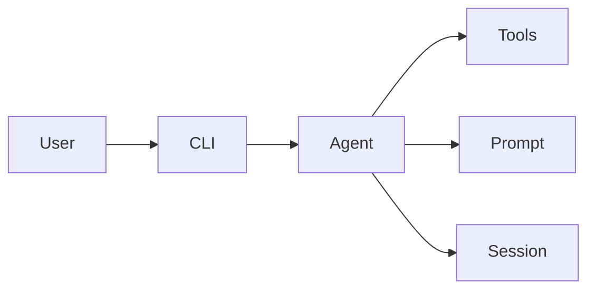

# 00. 引言

## 目标

本章说明 Python 版本的定位：

- 不是完整克隆，而是教学可运行最小实现
- 按参考教程章节拆分实现
- 保持核心架构一致，语言改为 Python

## 对应实现文件

- `src/agent.py`: 主循环与双后端
- `src/tools.py`: 6 个核心工具
- `src/prompt.py`: prompt 构造
- `src/cli.py`: REPL 与命令解析
- `src/session.py`: 会话存储
- `src/ui.py`: 终端输出

## 架构概览



## 核心代码速览

```python
from src.agent import Agent, AgentOptions


def bootstrap() -> Agent:
    """
    创建一个最小可运行 Agent。

    Returns:
        Agent: 已完成后端配置的 Agent 实例。
    """
    options = AgentOptions(
        model="claude-opus-4-6",
        yolo=False,
        thinking=False,
    )
    return Agent(options)
```

代码作用：

1. 展示 Python 版入口对象是 `Agent`，不是散落的全局函数。
2. `AgentOptions` 保持和参考版本一致的参数风格（模型、权限模式、thinking）。
3. 用最小构造方式说明本项目是“教学最小实现”，不是重框架脚手架。

## 设计约束

- 保留参考实现中的行为风格和关键细节
- 不额外引入重型框架
- 注释按统一模板和分段注释执行
