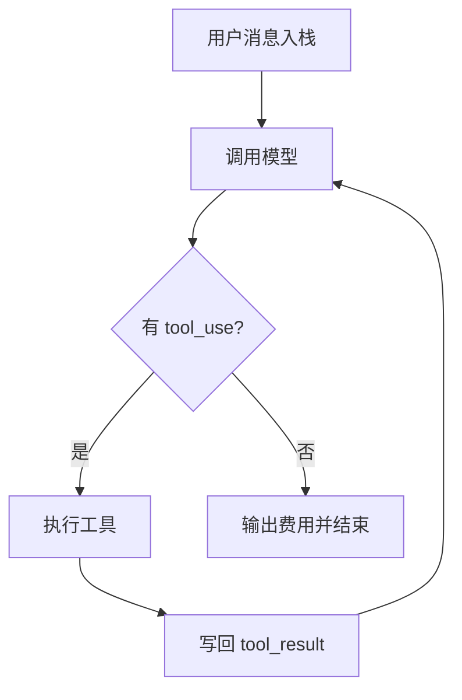

# 01. Agent Loop

## 本章实现

Python 版主循环位于 `src/agent.py` 的以下方法：

- `chat()`
- `chat_anthropic()`
- `chat_openai()`

## 循环流程



## 关键实现点

1. 用户消息先进入消息历史。
2. 调模型后提取 tool_use block。
3. 执行工具并回填 tool_result。
4. 无工具调用时结束循环。

## 核心代码（主循环）

```python
def chat_anthropic(self, user_message: str) -> None:
    """
    运行 Anthropic 后端主循环。

    Parameters:
        user_message (str): 用户输入。

    Returns:
        None: 通过循环驱动工具执行直至结束。
    """
    # 1) 用户输入先入历史，作为第一轮上下文。
    self.anthropic_messages.append({"role": "user", "content": user_message})

    while True:
        # 2) 中断信号优先级最高。
        if self.abort_event and self.abort_event.is_set():
            break

        # 3) 拉取一轮模型响应并更新 token 统计。
        response = self.call_anthropic_stream()
        usage = response.get("usage", {})
        self.total_input_tokens += int(usage.get("input_tokens", 0))
        self.total_output_tokens += int(usage.get("output_tokens", 0))

        # 4) 提取本轮工具调用。
        tool_uses = [b for b in response.get("content", []) if b.get("type") == "tool_use"]
        self.anthropic_messages.append({"role": "assistant", "content": response.get("content", [])})

        # 5) 无工具调用即完成。
        if not tool_uses:
            print_cost(self.total_input_tokens, self.total_output_tokens)
            break

        # 6) 执行工具并把结果回填为 user 消息。
        tool_results = []
        for tool_use in tool_uses:
            result = execute_tool(tool_use.get("name", ""), tool_use.get("input", {}))
            tool_results.append(
                {
                    "type": "tool_result",
                    "tool_use_id": tool_use.get("id", ""),
                    "content": result,
                }
            )
        self.anthropic_messages.append({"role": "user", "content": tool_results})
```

代码作用：

1. 这是整个 Agent 的“心脏 while 循环”。
2. 关键出口是 `if not tool_uses: break`，与参考章节一致。
3. 把工具结果回写成 user 消息是 Anthropic 格式要求。

## 中断机制

- 使用 `threading.Event` 模拟 abort 控制。
- Ctrl+C 时触发 `agent.abort()`，循环检查事件后退出。
