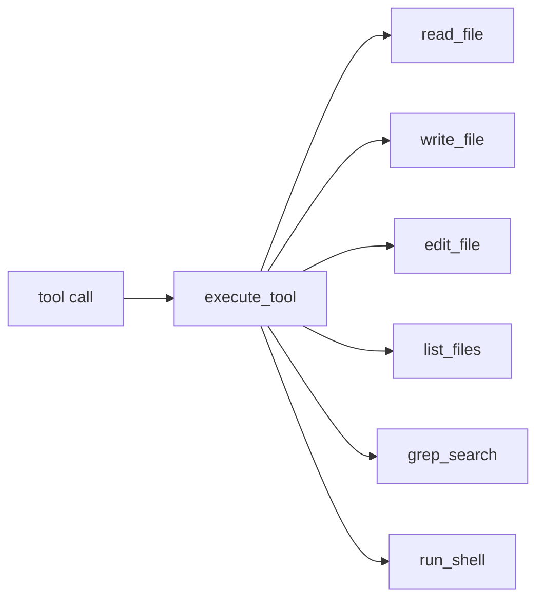

# 02. 工具系统

## 本章实现

工具定义和执行在 `src/tools.py`：

- `tool_definitions`
- `execute_tool()`

## 6 个工具

- `read_file`
- `write_file`
- `edit_file`
- `list_files`
- `grep_search`
- `run_shell`

## 分发结构



## 关键策略

1. `edit_file` 强制 `old_string` 唯一匹配。
2. 工具结果统一走 `truncate_result()`。
3. 搜索与命令输出限制返回条数，避免上下文膨胀。

## 核心代码（工具分发）

```python
def execute_tool(name: str, input_data: dict) -> str:
    """
    按工具名分发执行，并做统一截断保护。

    Parameters:
        name (str): 工具名。
        input_data (dict): 工具参数。

    Returns:
        str: 工具执行结果。
    """
    # 1) 分发表结构对齐 TS 版 switch/case。
    handlers = {
        "read_file": read_file,
        "write_file": write_file,
        "edit_file": edit_file,
        "list_files": list_files,
        "grep_search": grep_search,
        "run_shell": run_shell,
    }

    handler = handlers.get(name)
    if handler is None:
        return f"Unknown tool: {name}"

    # 2) 所有工具结果统一通过截断器，避免上下文爆炸。
    result = handler(input_data)
    return truncate_result(result)
```

## 核心代码（唯一匹配编辑）

```python
def edit_file(input_data: dict) -> str:
    file_path = Path(str(input_data["file_path"]))
    old_string = str(input_data["old_string"])
    new_string = str(input_data["new_string"])
    content = file_path.read_text(encoding="utf-8")

    # 1) 保证 old_string 在文件中恰好出现一次。
    count = content.count(old_string)
    if count == 0:
        return f"Error: old_string not found in {file_path}"
    if count > 1:
        return f"Error: old_string found {count} times. Must be unique."

    # 2) 只替换一次，避免误改同名代码块。
    updated = content.replace(old_string, new_string, 1)
    file_path.write_text(updated, encoding="utf-8")
    return f"Successfully edited {file_path}"
```

代码作用：

1. `execute_tool` 让每个工具有统一入口和统一输出治理。
2. `edit_file` 的唯一匹配机制是本项目最关键的编辑安全策略。
3. 这两段组合后，模型可以“可控地改代码”，而不是盲写整文件。
