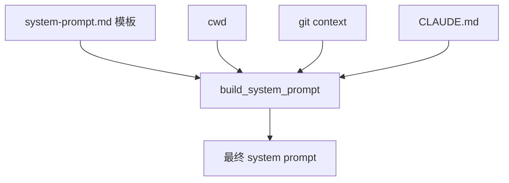

# 03. System Prompt

## 本章实现

对应文件：`src/prompt.py` 与 `src/system-prompt.md`。

## 构建流程



## 关键函数

- `load_claude_md()`: 从当前目录向上收集 `CLAUDE.md`
- `get_git_context()`: 收集分支、最近提交和工作区状态
- `build_system_prompt()`: 填充占位符

## 对齐原则

- 模板结构与参考版本一致
- 占位符替换方式保持简单链式 replace

## 核心代码（Prompt 构建）

```python
def build_system_prompt() -> str:
    """
    构造最终 System Prompt。

    Returns:
        str: 注入环境上下文后的完整提示词。
    """
    base_dir = Path(__file__).resolve().parent
    template = (base_dir / "system-prompt.md").read_text(encoding="utf-8")

    date_text = datetime.utcnow().strftime("%Y-%m-%d")
    platform_text = f"{platform.system().lower()} {platform.machine().lower()}"
    shell_text = os.environ.get("SHELL", "unknown")
    git_context = get_git_context()
    claude_md = load_claude_md()

    # 1) 用最直接的 replace 完成模板变量替换。
    return (
        template.replace("{{cwd}}", str(Path.cwd()))
        .replace("{{date}}", date_text)
        .replace("{{platform}}", platform_text)
        .replace("{{shell}}", shell_text)
        .replace("{{git_context}}", git_context)
        .replace("{{claude_md}}", claude_md)
    )
```

代码作用：

1. 把“固定规则”与“动态环境”合成一段可直接发给模型的 system prompt。
2. 动态部分包括 cwd、平台、shell、git 信息与项目级 CLAUDE.md。
3. 采用链式替换而非模板引擎，便于教学和调试。
