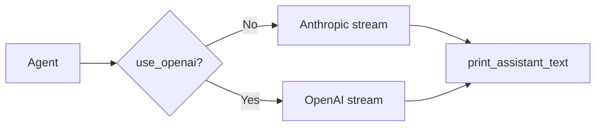

# 04. 流式输出与双后端

## 本章实现

对应 `src/agent.py`：

- `call_anthropic_stream()`
- `call_openai_stream()`

## 后端分流



## Anthropic 路径

1. 优先调用 stream 接口。
2. 逐段输出文本。
3. 流式不可用时降级 create。

## OpenAI 路径

1. 读取 chunk delta。
2. 累积 `content`。
3. 按 index 重组 `tool_calls`。

## 重试机制

- `with_retry()` 使用指数退避 + 抖动。
- 保留可重试状态码与错误特征匹配。

## 核心代码（OpenAI 流式重组）

```python
def call_openai_stream(self) -> dict:
    stream = self.openai_client.chat.completions.create(
        model=self.model,
        max_tokens=8096,
        tools=to_openai_tools(),
        messages=self.openai_messages,
        stream=True,
        stream_options={"include_usage": True},
    )

    content = ""
    tool_calls = {}

    # 1) 按 chunk 累积文本和 tool_calls 参数碎片。
    for chunk in stream:
        chunk_dict = self._model_to_dict(chunk)
        choices = chunk_dict.get("choices", [])
        if not choices:
            continue
        delta = choices[0].get("delta", {})

        if delta.get("content"):
            print_assistant_text(delta["content"])
            content += delta["content"]

        for tc in delta.get("tool_calls", []) or []:
            index = int(tc.get("index", 0))
            existing = tool_calls.get(index)
            if existing is None:
                tool_calls[index] = {
                    "id": tc.get("id", ""),
                    "name": tc.get("function", {}).get("name", ""),
                    "arguments": tc.get("function", {}).get("arguments", ""),
                }
            else:
                existing["arguments"] += tc.get("function", {}).get("arguments", "")

    # 2) chunk 收齐后按 index 还原完整 tool_calls 顺序。
    assembled_tool_calls = []
    for index in sorted(tool_calls.keys()):
        item = tool_calls[index]
        assembled_tool_calls.append(
            {
                "id": item["id"] or f"tool_{index}",
                "type": "function",
                "function": {"name": item["name"], "arguments": item["arguments"]},
            }
        )

    return {
        "choices": [
            {
                "message": {
                    "role": "assistant",
                    "content": content or None,
                    "tool_calls": assembled_tool_calls if assembled_tool_calls else None,
                }
            }
        ]
    }
```

代码作用：

1. 解释了为什么 OpenAI 流式工具调用必须“先累积再重组”。
2. 把 `delta.tool_calls` 碎片拼回完整 JSON 参数，才能后续执行工具。
3. 这段代码是双后端兼容里最核心的差异点。
