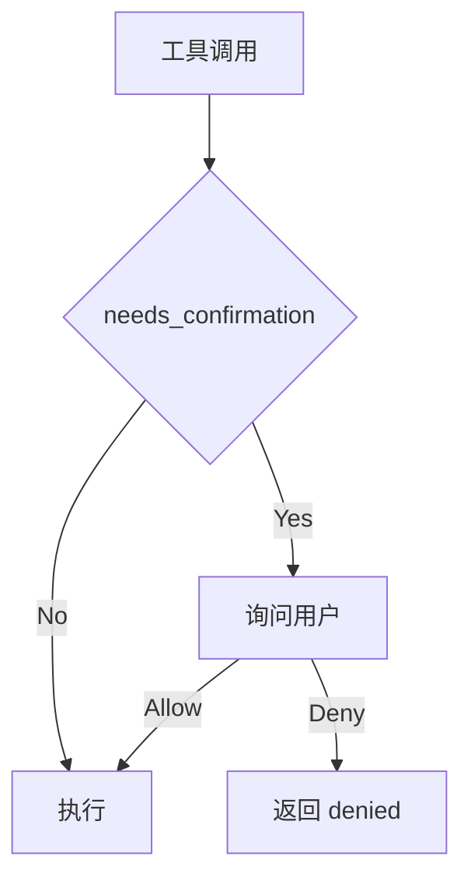

# 05. 权限与安全

## 本章实现

对应 `src/tools.py` 和 `src/agent.py`：

- `is_dangerous()`
- `needs_confirmation()`
- `confirm_dangerous()`

## 安全流程



## 关键策略

1. 危险命令模式匹配（正则）。
2. 新建文件和编辑不存在文件要求确认。
3. 会话级 `confirmed_paths` 防止重复确认。
4. `--yolo` 模式跳过确认。

## 核心代码（确认策略）

```python
def needs_confirmation(tool_name: str, input_data: dict) -> str | None:
    """
    判断当前操作是否需要确认。

    Parameters:
        tool_name (str): 工具名。
        input_data (dict): 工具参数。

    Returns:
        str | None: 需要确认时返回确认文案。
    """
    # 1) 高风险 shell 命令。
    if tool_name == "run_shell" and is_dangerous(str(input_data.get("command", ""))):
        return str(input_data.get("command", ""))

    # 2) 创建新文件。
    if tool_name == "write_file" and not Path(str(input_data.get("file_path", ""))).exists():
        return f"write new file: {input_data.get('file_path', '')}"

    # 3) 编辑不存在文件。
    if tool_name == "edit_file" and not Path(str(input_data.get("file_path", ""))).exists():
        return f"edit non-existent file: {input_data.get('file_path', '')}"

    return None
```

```python
def confirm_dangerous(self, command: str) -> bool:
    """
    向用户确认危险动作。

    Parameters:
        command (str): 待确认动作描述。

    Returns:
        bool: 用户允许则返回 True。
    """
    print_confirmation(command)
    answer = input("  Allow? (y/n): ").strip().lower()
    return answer.startswith("y")
```

代码作用：

1. 把“是否要问用户”与“如何问用户”拆成两个职责单一函数。
2. `needs_confirmation` 只做策略判断，`confirm_dangerous` 只做交互。
3. 配合 `confirmed_paths` 可避免同一命令反复确认。
