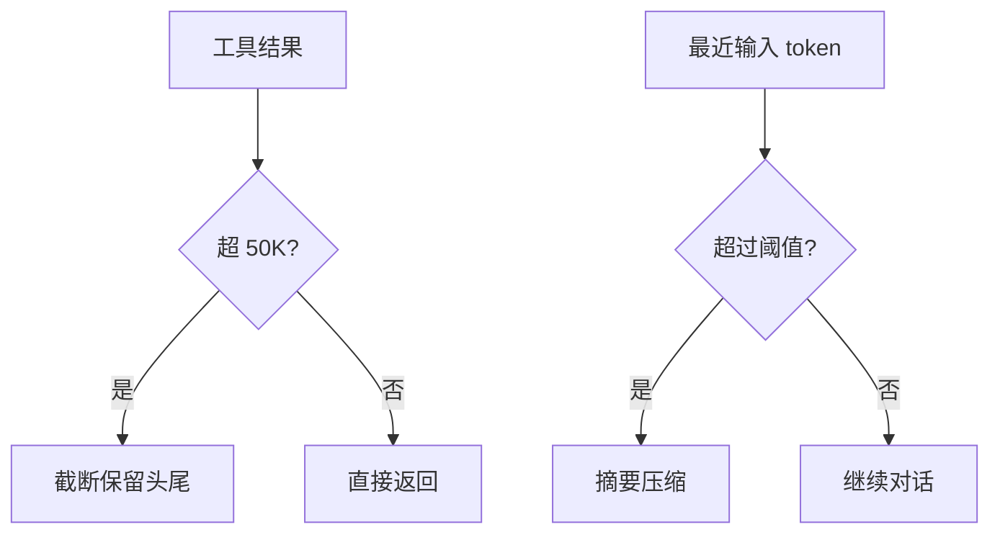

# 06. 上下文管理

## 本章实现

对应 `src/tools.py` 与 `src/agent.py`：

- `truncate_result()`
- `check_and_compact()`
- `compact_anthropic()`
- `compact_openai()`

## 双层保护



## 压缩策略

1. 阈值：`last_input_token_count > effective_window * 0.85`
2. 摘要替换早期历史
3. 保留最后一条用户消息

## 核心代码（结果截断 + 自动压缩）

```python
MAX_RESULT_CHARS = 50_000


def truncate_result(result: str) -> str:
    """
    截断过长工具输出，并保留头尾。

    Parameters:
        result (str): 原始结果。

    Returns:
        str: 截断后结果。
    """
    if len(result) <= MAX_RESULT_CHARS:
        return result

    keep_each = (MAX_RESULT_CHARS - 60) // 2
    omitted = len(result) - keep_each * 2
    return (
        result[:keep_each]
        + f"\n\n[... truncated {omitted} chars ...]\n\n"
        + result[-keep_each:]
    )


def check_and_compact(self) -> None:
    """
    当上下文接近上限时触发压缩。

    Returns:
        None
    """
    # 1) 按最近一次输入 token 判断是否触发。
    if self.last_input_token_count > self.effective_window * 0.85:
        print_info("Context window filling up, compacting conversation...")
        self.compact_conversation()
```

代码作用：

1. `truncate_result` 是第一道防线，控制单次工具输出体积。
2. `check_and_compact` 是第二道防线，控制累计对话长度。
3. 两层叠加后，长任务更不容易触发上下文超限报错。
