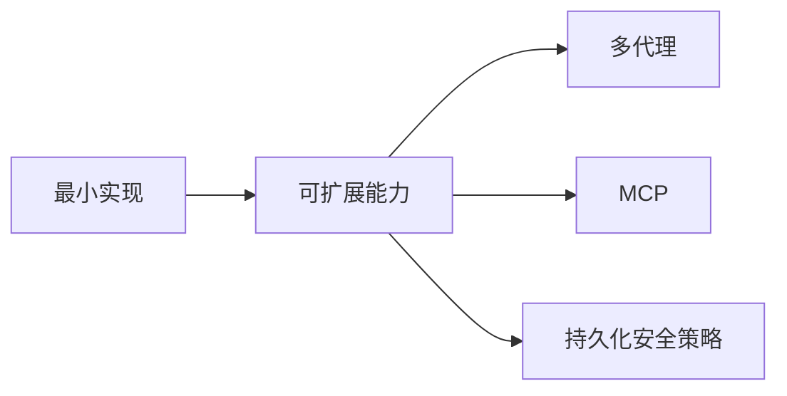

# 08. 架构对比与下一步

## 已完成能力

- Python 版 Agent Loop
- 6 工具实现与分发
- 双后端流式处理
- 权限确认与 yolo 模式
- 自动压缩与会话恢复

## 可扩展方向

1. 增加子代理工具（sub-agent）。
2. 增加 MCP 工具接入层。
3. 增强权限系统（持久化规则）。
4. 增加更丰富 UI（如 Rich/Textual）。

## 对齐声明

当前实现按参考教程语义优先，保持“最小可用 + 教学导向”的设计原则。

## 扩展示例代码（Sub-agent 原型）

```python
from dataclasses import dataclass


@dataclass
class SubAgentTask:
    """
    子代理任务结构。

    Parameters:
        task (str): 子任务描述。

    Returns:
        SubAgentTask: 任务对象。
    """

    task: str


def execute_sub_agent(task: SubAgentTask) -> str:
    """
    用独立 Agent 处理子任务。

    Parameters:
        task (SubAgentTask): 子任务输入。

    Returns:
        str: 子代理执行结果摘要。
    """
    # 1) 创建独立实例，避免污染主会话消息历史。
    sub_agent = Agent(AgentOptions(model="claude-sonnet-4-6"))

    # 2) 这里按最小原型返回摘要，后续可替换成真正工具调用。
    sub_agent.chat(f"Complete this sub-task and summarize result: {task.task}")
    return "Sub-agent finished."
```

代码作用：

1. 给出一个可演进的“多 Agent”切入点。
2. 强调子代理应隔离上下文，避免主会话被污染。
3. 这段是扩展原型，不改变当前最小核心架构。


